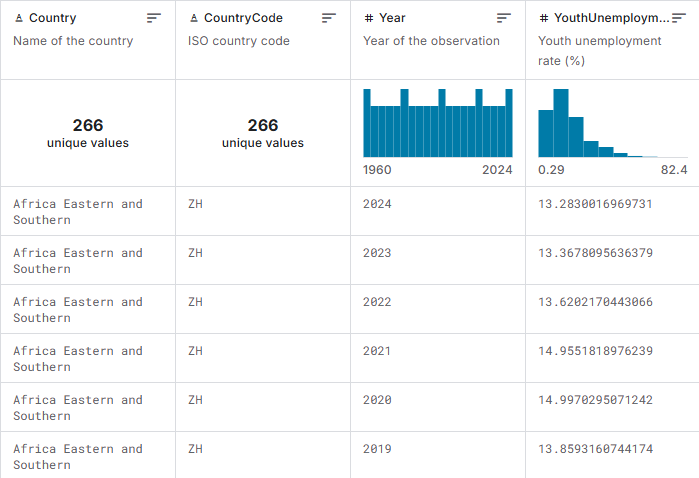
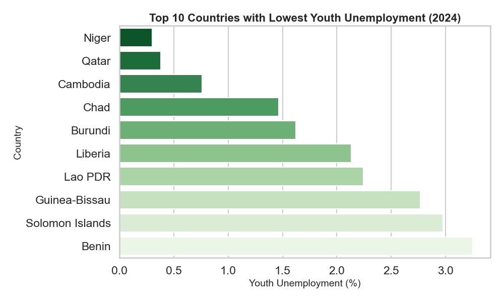
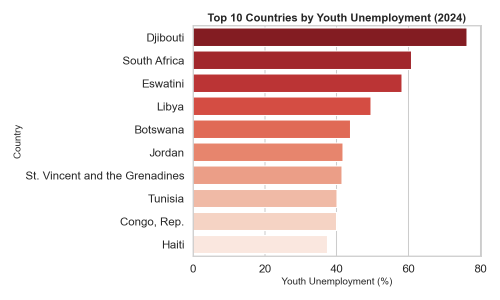
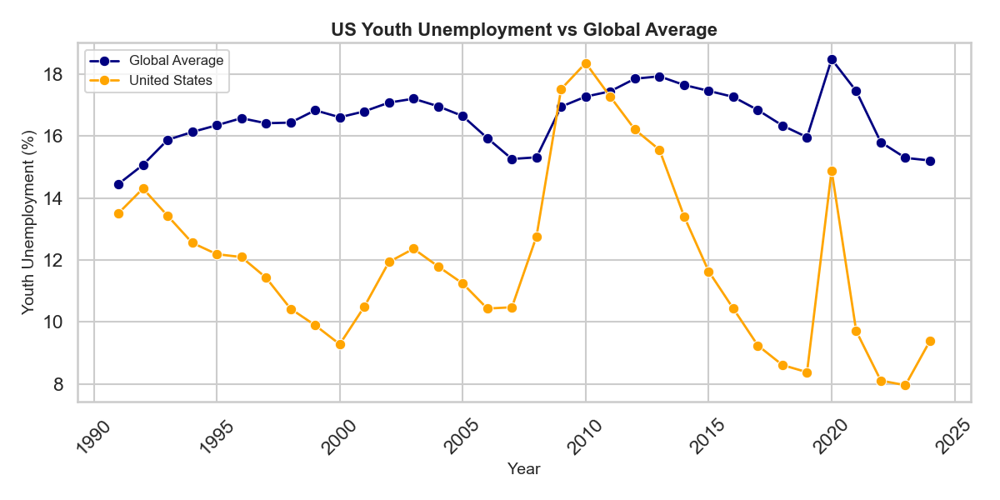

# COMP3125  

## Introduction  
The objective of this project is to apply data science techniques to clean, analyze, and visualize data related to youth unemployment across the world. Understanding youth unemployment is important because high rates can have social, economic, and political impacts. Using this dataset, we explored patterns of youth unemployment in different countries, compared the US to global trends, and highlighted countries with the highest and lowest unemployment levels.  

## Selection of Data  
All code and visualizations were executed in an IDE, and the project is hosted in this [GitHub repository](https://github.com/jeffreyzhtam/unemploymentDataScienceProject).  

The dataset used can be found [here](https://www.kaggle.com/datasets/umitka/global-youth-unemployment-dataset).  

### Data Preview:  
  

The dataset includes the following columns:  
+ **Country**: Name of the country  
+ **CountryCode**: ISO code for the country  
+ **Year**: Year of observation  
+ **YouthUnemployment**: Youth unemployment rate (%)  

All data was cleaned for null and duplicate values.  

## Methods  
**Tools used:**  
+ Python libraries: Pandas, Matplotlib, Seaborn  
+ GitHub for version control  
+ VS Code as IDE  

**Steps:**  
1. Data cleaning: removed nulls and duplicates  
2. Exploratory data analysis: examined trends, extremes, and comparisons  
3. Visualization: line plots, bar charts, and comparative analysis between countries  

## Results  
The results of our analysis provide several key insights into youth unemployment globally:  

**1. Countries with the Lowest Youth Unemployment**  
This visual shows the top 10 countries with the lowest youth unemployment in the most recent year. While countries like Niger, Qatar, and Cambodia appear to have low youth unemployment rates, further research suggests that these low rates may not always indicate positive outcomes. In some cases, they reflect a high number of low-paying jobs and situations where young people enter the workforce at an early age to support their families. This highlights the importance of considering the quality and conditions of employment, not just the unemployment rate.  

  

**2. Countries with the Highest Youth Unemployment**  
The top 10 countries with the highest youth unemployment are highlighted here. These countries face significant youth labor challenges, which may result from economic instability, limited education or training opportunities, or other socio-economic factors. From an economic perspective, high youth unemployment often occurs when the economy is underperforming, leading to fewer new job openings for young people entering the workforce.  

  

**3. US Youth Unemployment vs Global Average**  
This line chart compares youth unemployment in the United States to the global average over time. It highlights periods where the US performed better or worse than the global trend, providing insight into national policy effectiveness and economic conditions. Notably, the recession around 2010 and the COVID-19 pandemic in 2020 caused a significant increase in unemployment rates.  

  

## Discussion  
Through our analysis, we observed several patterns:  

+ **Lowest vs Highest Unemployment**: Countries with strong education systems and robust economies tend to have lower youth unemployment. However, extremely low youth unemployment may also indicate that children or teenagers from lower-income families are entering the workforce early to support their households. Countries facing economic or political instability often have the highest youth unemployment rates.  
+ **Trends over Time**: Global youth unemployment has fluctuated over the years, with some countries showing improvements while others remain consistently high.  
+ **US Comparison**: The US generally follows global trends but occasionally deviates, suggesting that national policies can influence youth employment outcomes.  

## Summary  
In this project, we analyzed youth unemployment data to uncover trends across countries and over time. Through data cleaning, visualization, and comparative analysis, we identified countries with extreme youth unemployment rates and examined the US in a global context. This project allowed us to apply the data science skills learned in class to a socially relevant dataset and gain insights into global labor market trends.  

Future work could include:  
+ Investigating factors contributing to high or low youth unemployment in specific countries  
+ Exploring correlations with GDP, education level, or labor market policies  
+ Predicting future youth unemployment trends using machine learning models  

## References  
+ [Global Youth Unemployment Dataset: Kaggle](https://www.kaggle.com/datasets/umitka/global-youth-unemployment-dataset)  
+ [Seaborn Documentation](https://seaborn.pydata.org/index.html)  
+ [Matplotlib Documentation](https://matplotlib.org/stable/index.html)  
